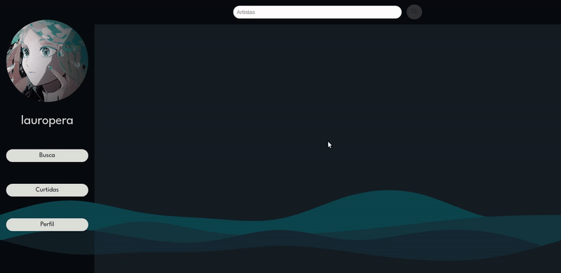
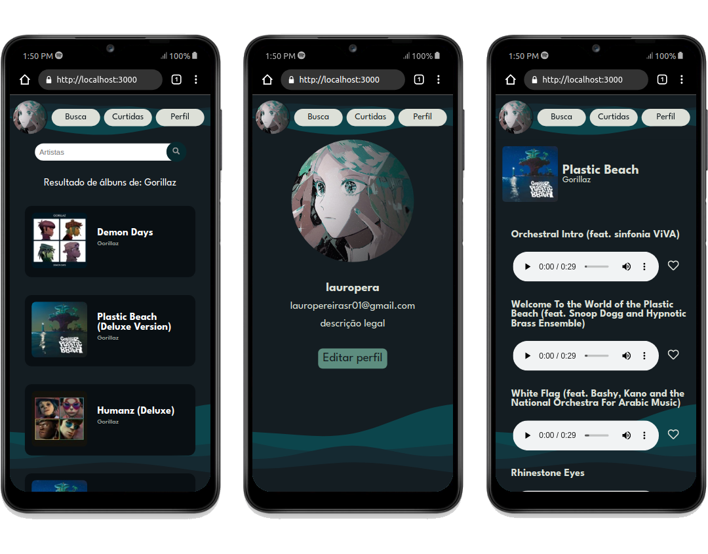
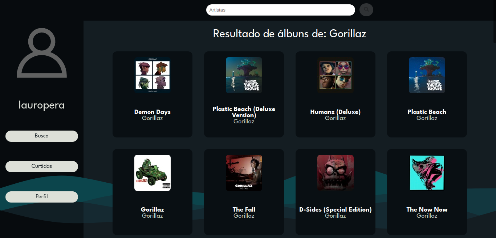
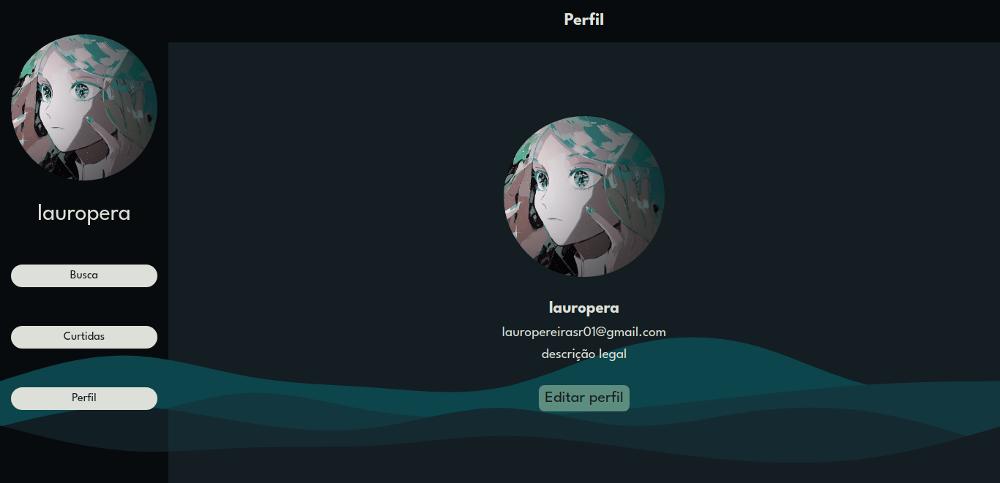
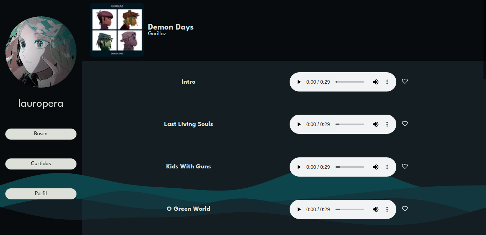
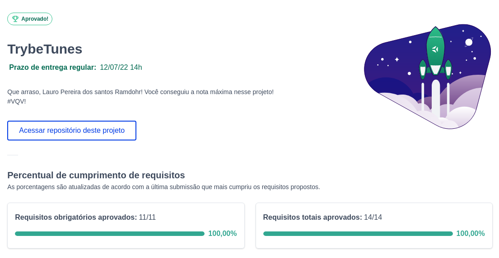

# :musical_keyboard: Trybetunes

## Acesse meu projeto <a href="https://lauropera.github.io/trybetunes/">AQUI</a>

## :satellite: Desenvolvimento

Projeto desenvolvido na <a href="https://betrybe.com/" target="_blank">Trybe</a> durante o módulo de Front-End!

Nesse projeto desenvolvemos uma aplicação para ouvir músicas. Consultamos uma API para conseguir as informações de cada álbum e criamos rotas para encaminhar o usuário para cada área da aplicação. 

## :hammer_and_wrench: Tecnologias

* HTML
* CSS
* JavaScript
* React.js
* React Router

# :iphone: Mobile

# :camera: Screenshots

## :heavy_check_mark: Nota

